# 🔐 PictoFold Authentication System Guide

**Version:** 1.0  
**Status:** Production Ready  
**Technology:** Spring Boot Security, JWT, BCrypt, SMTP

---

## 📖 Table of Contents
1.  [Executive Summary](#-executive-summary)
2.  [System Architecture](#-system-architecture)
3.  [Authentication Workflows](#-authentication-workflows)
    -   [User Registration (Signup)](#1-user-registration-signup)
    -   [Identity Verification (OTP)](#2-identity-verification-otp)
    -   [Secure Login (JWT)](#3-secure-login-jwt)
    -   [Accessing Protected Resources](#4-accessing-protected-resources)
4.  [Database Schema](#-database-schema)
5.  [Security Best Practices](#-security-best-practices)

---

## 🚀 Executive Summary

The PictoFold backend employs a **defense-in-depth** security strategy. We prioritize user data protection through industry-standard encryption and stateless session management.

*   **Identity Verification**: We ensure every user is real via a secure Email OTP (One-Time Password) system.
*   **Stateless Sessions**: We use JSON Web Tokens (JWT) to manage user sessions, allowing the system to scale infinitely without server-side session storage.
*   **Data Encryption**: All sensitive secrets (Passwords, OTPs) are hashed using BCrypt before ever touching the database.

---

## 🏗 System Architecture

The system is built on four core pillars:

| Component | Responsibility |
| :--- | :--- |
| **AuthService** | The **Brain**. Handles business logic, validation, and coordinates between DB and Email services. |
| **JwtUtils** | The **Keymaster**. Generates cryptographically signed tokens and validates their authenticity. |
| **JwtAuthenticationFilter** | The **Gatekeeper**. Intercepts every HTTP request to check for a valid "Access Pass" (Token). |
| **EmailService** | The **Courier**. Delivers time-sensitive verification codes to users. |

---

## 🔄 Authentication Workflows

### 1. User Registration (Signup)
*Goal: Create a new account and initiate verification.*

When a user signs up, we don't just trust them immediately. We create their account in a **"Locked"** state (`emailVerified = false`).

```mermaid
sequenceDiagram
    autonumber
    actor User
    participant API as Auth Controller
    participant Service as Auth Service
    participant DB as Database
    participant Mail as Email System

    User->>API: Submit Registration Form
    API->>Service: Process Signup Request
    Service->>DB: Check for Existing Email
    
    alt Email Available
        Service->>Service: Hash Password (BCrypt)
        Service->>Service: Generate Secure 6-Digit OTP
        Service->>DB: Save User (Status: Unverified)
        Service->>Mail: Dispatch OTP Email
        Mail-->>User: 📩 "Your Verification Code: 123456"
        Service-->>User: ✅ "Account Created. Please Verify Email."
    else Email Taken
        Service-->>User: ❌ "Email already in use."
    end
```

---

### 2. Identity Verification (OTP)
*Goal: Prove ownership of the email address.*

The user must provide the code sent to their email. This code is valid for **10 minutes** and expires automatically.

```mermaid
sequenceDiagram
    autonumber
    actor User
    participant API as Auth Controller
    participant Service as Auth Service
    participant DB as Database

    User->>API: Submit OTP Code
    API->>Service: Validate Code
    Service->>DB: Retrieve User Record
    
    rect rgb(240, 248, 255)
        note right of Service: Security Checks
        Service->>Service: Is Code Expired?
        Service->>Service: Is Max Attempts Exceeded?
        Service->>Service: Does Hash Match?
    end

    alt Checks Pass
        Service->>DB: Update Status -> Verified
        Service->>DB: Clear OTP Data
        Service-->>User: ✅ "Email Verified Successfully!"
    else Checks Fail
        Service->>DB: Increment Failure Count
        Service-->>User: ❌ "Invalid or Expired Code."
    end
```

---

### 3. Secure Login (JWT)
*Goal: Exchange credentials for a digital access pass.*

Once verified, the user logs in. If successful, they receive a **JWT Token**. Think of this token as a digital ID card.

```mermaid
sequenceDiagram
    autonumber
    actor User
    participant API as Auth Controller
    participant Service as Auth Service
    participant Key as JWT Utility

    User->>API: Login (Email + Password)
    API->>Service: Authenticate
    
    alt Credentials Valid
        Service->>Key: Generate Signed Token
        Key-->>Service: Return "eyJh..."
        Service-->>User: 🔑 { "token": "eyJh...", "message": "Success" }
    else Invalid
        Service-->>User: ⛔ "Invalid Credentials"
    end
```

---

### 4. Accessing Protected Resources
*Goal: Perform actions as an authenticated user.*

For subsequent requests (like "Get My Profile"), the user attaches the Token to the request header.

```mermaid
sequenceDiagram
    autonumber
    actor User
    participant Gate as Security Filter
    participant App as Application Logic

    User->>Gate: Request Data (Header: "Bearer <Token>")
    Gate->>Gate: Validate Token Signature
    
    alt Token Valid
        Gate->>App: Allow Access (User Identity Confirmed)
        App-->>User: 📦 Return Requested Data
    else Token Invalid/Expired
        Gate-->>User: 🚫 403 Forbidden (Access Denied)
    end
```

---

## 💾 Database Schema

We store user data with strict constraints to ensure integrity.

| Field | Type | Description |
| :--- | :--- | :--- |
| `id` | `Long` | Unique ID for internal referencing. |
| `email` | `String` | **Unique Index**. The user's primary identity. |
| `passwordHash` | `String` | **Encrypted**. We never store plain text passwords. |
| `emailVerified` | `Boolean` | **Flag**. Prevents login until true. |
| `otpHash` | `String` | **Encrypted**. Even database admins cannot see the OTP code. |
| `otpExpiresAt` | `Instant` | **Time-bomb**. Code self-destructs after 10 mins. |
| `otpAttempts` | `Integer` | **Counter**. Locks out after 5 failed tries. |

---

## 🛡 Security Best Practices Implemented

1.  **Zero Trust Storage**: We assume the database could be compromised. That's why we hash **both** passwords and OTPs.
2.  **Rate Limiting**: Users can only request a new OTP once every 60 seconds. This prevents "SMS/Email Bombing" attacks.
3.  **Brute Force Protection**: After 5 failed OTP guesses, the user must request a new code.
4.  **Statelessness**: By using JWTs, the server doesn't need to remember users. This makes the backend faster and easier to scale.

---
*Generated for PictoFold Project Documentation*
